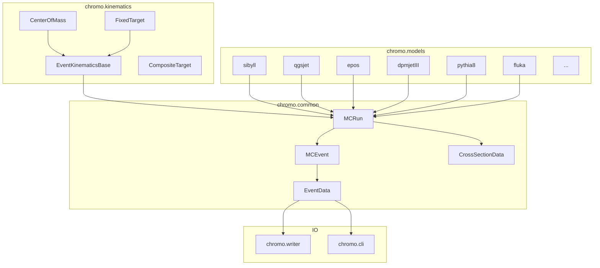

# Architecture

chromo is organized into three cooperating layers: **kinematics**, **common**, and **models**.
A thin I/O layer sits above the common layer for output and command-line use.

---

## Program structure



---

## Layer descriptions

### Kinematics layer — `chromo.kinematics`

The kinematics layer provides a unified language for specifying collisions, independent of the
underlying generator.

- **`CenterOfMass(ecm, beam, target)`** — specifies a collision at a given center-of-mass energy.
- **`FixedTarget(elab, beam, target)`** — specifies a fixed-target experiment at a given
  lab-frame energy per nucleon.
- **`CompositeTarget([(species, weight), ...])`** — a weighted mixture of target materials
  (e.g., air = 78% N14 + 21% O16 + 1% Ar40). The common layer decomposes composite events
  automatically.

All kinematics objects understand particle identifiers given as names (`"p"`, `"Pb208"`,
`"gamma"`), PDG IDs (integers), or `(Z, A)` tuples for nuclei. Energy units are GeV throughout.
Conversions between center-of-mass and lab frames, and per-nucleon scaling, are handled
transparently so the same kinematics object works with any generator.

### Common layer — `chromo.common`

The common layer defines the abstract interface that all generators implement.

**`MCRun`** is the abstract base class for every generator. It is responsible for:

- Accepting a kinematics object and validating it against the model's supported range (beam type,
  target mass, energy floor/ceiling).
- Initializing the compiled Fortran or C++ backend.
- Providing the `__call__(N)` generator loop that calls `_generate()` N times, reading one event
  per call.
- Computing cross sections via `cross_section()`, delegating to the model's `_cross_section()`.
- Decomposing `CompositeTarget` into per-component sub-generators and merging results.
- Enforcing the single-instantiation constraint via `_abort_if_already_initialized()`.

**`MCEvent`** reads the particle stack produced by a single call to the backend. For Fortran
models this means reading the HEPEVT common block (particle IDs, momenta, status flags, vertex
positions, and parent/daughter indices) into numpy arrays. For Pythia 8 it reads the
C++ event record via pybind11. `MCEvent` also applies Lorentz boosts to transform from the
generator's internal frame to the frame requested by the user.

**`EventData`** is a picklable dataclass holding all particle properties for one event:

| Attribute | Content |
|-----------|---------|
| `pid` | PDG particle IDs (int32 array) |
| `px, py, pz` | Momenta in GeV/c |
| `en` | Energies in GeV |
| `mass` | Masses in GeV/c² |
| `vx, vy, vz, vt` | Production vertices |
| `status` | HEPEVT status codes |
| `pname` | Particle names (optional) |

Key filtering methods: `final_state()` returns particles with status 1; `final_state_charged()`
further restricts to charged particles. Frame transformations and HepMC3 export are also
provided.

**`CrossSectionData`** is a simple dataclass holding `total`, `elastic`, `inelastic`, and
diffractive cross sections in millibarn.

### Model layer — `chromo.models.*`

Each model file (e.g., `sibyll.py`, `qgsjet.py`, `pythia8.py`, `fluka.py`) subclasses `MCRun`
and `MCEvent` and provides:

- `_generate()` — calls the compiled backend to produce one event.
- `_set_kinematics()` — communicates the beam/target/energy to the backend.
- `_cross_section()` — queries the backend for cross sections.
- `_set_stable()` — configures which particles are decayed (where supported).

Fortran models are compiled with **f2py** (via a custom wrapper generator in
`scripts/generate_f2py.py`). The Pythia 8 model uses **pybind11** C++ bindings defined in
`src/cpp/_pythia8.cpp`.

Models that are part of the public API are listed in `src/chromo/models/__init__.py:__all__`.
Additional experimental or legacy models live in `src/chromo/models/_extra_models.py`.

---

## Data flow

```
User creates kinematics object
        │
        ▼
Model constructor validates kinematics, initializes Fortran/C++ backend
        │
        ▼
generator(N) calls _generate() in a loop (N iterations)
        │
        ▼
_generate() calls Fortran/C++ routine → populates HEPEVT common block (or C++ event record)
        │
        ▼
MCEvent reads particle stack into numpy arrays
        │
        ▼
Lorentz boost applied to reach user-requested frame
        │
        ▼
EventData yielded to user
        │
        ├──► final_state() / final_state_charged() filtering
        ├──► HepMC3 / ROOT export via chromo.writer
        └──► CLI output via chromo.cli
```

---

## Why Fortran global state matters

Fortran COMMON blocks are **process-global** variables. When a Fortran model's initialization
routine runs, it writes configuration into these shared memory regions. A second call to the
same routine would overwrite the state left by the first, causing undefined behaviour.

chromo enforces the single-instantiation constraint via `_abort_if_already_initialized()`,
called at the start of every model's `__init__`. Attempting to create a second instance raises
a `RuntimeError` immediately rather than silently corrupting results.

**Practical implications:**

- Run each model in its own Python process if you need multiple configurations.
- Use `multiprocessing` or subprocess spawning for parallel parameter scans.
- The chromo test suite exploits this by running each model's test in a separate subprocess
  (see `tests/util.py:run_in_separate_process`).

!!! info "Pythia 8 is the same"
    Although Pythia 8 is a C++ library (not Fortran), it also uses internal global state.
    All three `Pythia8*` classes share one compiled library, so the same one-per-process
    constraint applies.

---

## Build system overview

The build uses **Meson** (via `mesonpy`). Compiled extension modules are placed in `build/cp*/`.
Model selection is controlled by the `[tool.chromo] enabled-models` list in `pyproject.toml`.

| Backend technology | Used by |
|---|---|
| f2py | SIBYLL, QGSJet, DPMJET, EPOS, UrQMD, SOPHIA, PYTHIA 6, FLUKA |
| pybind11 (C++) | Pythia 8 |

For models with hundreds of source files (DPMJET 19.x has 700+), `meson.build` writes source
lists to response files and passes `--source-file-list` to `generate_f2py.py` to stay within
operating-system command-line length limits.
