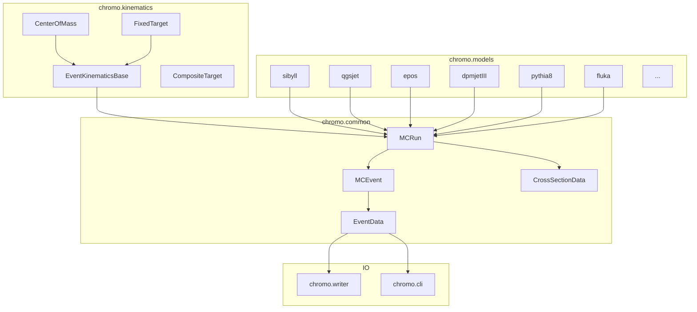

# chromo Documentation Site Implementation Plan

> **For agentic workers:** REQUIRED SUB-SKILL: Use superpowers:subagent-driven-development (recommended) or superpowers:executing-plans to implement this plan task-by-task. Steps use checkbox (`- [ ]`) syntax for tracking.

**Goal:** Build a MkDocs + Material documentation site for chromo, targeting physicist users, with auto-generated API docs and embedded Jupyter notebooks.

**Architecture:** A `docs/` directory at the project root holds all Markdown source files. `mkdocs.yml` at the project root configures navigation, theme, and plugins. API reference pages use `mkdocstrings` directives that pull from docstrings at build time. Notebooks in `examples/` are referenced directly by `mkdocs-jupyter` (no copying or symlinking needed).

**Tech Stack:** MkDocs, mkdocs-material, mkdocstrings[python], mkdocs-jupyter, griffe (mkdocstrings backend)

**Branch:** `docs/mkdocs` off `feature_fluka`

---

## Phase 1: Scaffold + User Guide + Notebooks + API Stubs

### Task 1: Create branch and install doc dependencies

**Files:**
- Modify: `pyproject.toml` (add `[project.optional-dependencies] docs`)

- [ ] **Step 1: Create the docs branch off feature_fluka**

```bash
git checkout feature_fluka
git checkout -b docs/mkdocs
```

- [ ] **Step 2: Add docs optional dependency group to pyproject.toml**

Find the `[project.optional-dependencies]` section in `pyproject.toml` and add:

```toml
docs = [
    "mkdocs-material",
    "mkdocstrings[python]",
    "mkdocs-jupyter",
]
```

- [ ] **Step 3: Install doc dependencies**

```bash
pip install mkdocs-material "mkdocstrings[python]" mkdocs-jupyter
```

Expected: all three packages install successfully.

- [ ] **Step 4: Commit**

```bash
git add pyproject.toml
git commit -m "build: add docs optional dependency group (mkdocs + plugins)"
```

---

### Task 2: Create mkdocs.yml and index page

**Files:**
- Create: `mkdocs.yml`
- Create: `docs/index.md`

- [ ] **Step 1: Create mkdocs.yml**

Create `mkdocs.yml` at the project root with this content:

```yaml
site_name: chromo
site_description: Cosmic Ray and Hadronic Interaction Monte Carlo Frontend
site_url: https://impy-project.github.io/chromo
repo_url: https://github.com/impy-project/chromo
repo_name: impy-project/chromo

theme:
  name: material
  logo: doc/chromo.svg
  favicon: doc/chromo.svg
  palette:
    - media: "(prefers-color-scheme: light)"
      scheme: default
      primary: deep purple
      accent: amber
      toggle:
        icon: material/brightness-7
        name: Switch to dark mode
    - media: "(prefers-color-scheme: dark)"
      scheme: slate
      primary: deep purple
      accent: amber
      toggle:
        icon: material/brightness-4
        name: Switch to light mode
  features:
    - navigation.sections
    - navigation.expand
    - navigation.top
    - search.suggest
    - content.code.copy

plugins:
  - search
  - mkdocstrings:
      handlers:
        python:
          options:
            show_source: false
            show_root_heading: true
            show_root_full_path: false
            heading_level: 3
            members_order: source
            docstring_style: numpy
  - mkdocs-jupyter:
      include: ["examples/*.ipynb"]
      ignore_h1_titles: true
      execute: false

markdown_extensions:
  - admonition
  - pymdownx.details
  - pymdownx.superfences
  - pymdownx.tabbed:
      alternate_style: true
  - pymdownx.highlight:
      anchor_linenums: true
  - pymdownx.inlinehilite
  - toc:
      permalink: true
  - attr_list
  - tables

nav:
  - Home: index.md
  - Getting Started:
    - Installation: getting-started/installation.md
    - Your First Simulation: getting-started/first-simulation.md
    - Building with FLUKA: getting-started/building-with-fluka.md
  - User Guide:
    - Kinematics: user-guide/kinematics.md
    - Running a Generator: user-guide/running-a-generator.md
    - Working with Events: user-guide/working-with-events.md
    - Cross Sections: user-guide/cross-sections.md
    - Output Formats: user-guide/output-formats.md
    - Decay Handling: user-guide/decay-handling.md
  - Models:
    - Overview: models/overview.md
    - Pythia 8 Guide: models/pythia8-guide.md
    - SIBYLL Variants: models/sibyll-variants.md
    - DPMJET & PHOJET: models/dpmjet-phojet.md
    - FLUKA: models/fluka.md
  - Architecture: architecture.md
  - Examples:
    - Comparing Models: examples/compare_models.ipynb
    - Cross Sections: examples/cross_section.ipynb
    - Nuclear Cross Sections: examples/nuclear_cross_sections.ipynb
    - Final State Particles: examples/count_final_state_particles.ipynb
    - Photon-Proton: examples/gamma_p.ipynb
    - Photon-Photon: examples/gamma_gamma_example.ipynb
    - HepMC IO & Visualization: examples/hepmc_io_and_visualization.ipynb
    - Hyperon Feed-Down: examples/hyperon_feed_down.ipynb
    - Decay Handler: examples/decayhandler.ipynb
    - ROOT Output: examples/write_root.ipynb
    - FLUKA & DPMJET Residuals: examples/fluka_dpmjet_residual_nuclei.ipynb
  - API Reference:
    - chromo.kinematics: api/kinematics.md
    - chromo.common: api/common.md
    - chromo.models: api/models.md
    - chromo.writer: api/writer.md
    - chromo.cli: api/cli.md
  - Citation: citation.md
```

- [ ] **Step 2: Create docs/index.md**

Create `docs/index.md`:

```markdown
# chromo

**Cosmic Ray and Hadronic Interaction Monte Carlo Frontend**

chromo provides a simple, unified Python interface to popular hadronic event generators used in cosmic-ray and high-energy particle physics. It removes the need for Fortran-style interfaces, ASCII input cards, and complex C++ dependencies.

## Quick Example

```python
import chromo

kinematics = chromo.kinematics.CenterOfMass(
    13 * chromo.constants.TeV, "proton", "proton"
)
generator = chromo.models.Sibyll23d(kinematics)

for event in generator(100):
    event = event.final_state_charged()
    print(f"Event {event.nevent}: {len(event)} charged particles")
```

## Supported Generators

chromo wraps **9 model families** with **26 model classes**, covering hadron-hadron, hadron-nucleus, nucleus-nucleus, photon-hadron, and electron-positron collisions:

DPMJET-III, EPOS-LHC, FLUKA, PHOJET, PYTHIA 6, PYTHIA 8 (including Cascade and Angantyr), QGSJet, SIBYLL, SOPHIA, and UrQMD.

See the [Model Overview](models/overview.md) for a full capability table.

## Getting Started

- **[Installation](getting-started/installation.md)** -- install from PyPI or build from source
- **[Your First Simulation](getting-started/first-simulation.md)** -- step-by-step walkthrough
- **[User Guide](user-guide/kinematics.md)** -- kinematics, events, cross sections, and more

## Citation

If you use chromo in your research, please cite:

> A. Fedynitch, H. Dembinski and A. Prosekin, *Chromo: A high-performance python interface to hadronic event generators for collider and cosmic-ray simulations*, [Comput.Phys.Commun. 321 (2026) 110031](https://doi.org/10.1016/j.cpc.2026.110031), [arXiv:2507.21856](https://arxiv.org/abs/2507.21856)
```

- [ ] **Step 3: Verify the site builds**

```bash
mkdocs build --strict 2>&1 | head -20
```

This will fail because the other pages don't exist yet. That's expected -- we just want to confirm mkdocs finds the config and starts processing. Ignore missing page warnings.

- [ ] **Step 4: Commit**

```bash
git add mkdocs.yml docs/index.md
git commit -m "docs: add mkdocs.yml scaffold and index page"
```

---

### Task 3: Getting Started pages

**Files:**
- Create: `docs/getting-started/installation.md`
- Create: `docs/getting-started/first-simulation.md`
- Create: `docs/getting-started/building-with-fluka.md`

- [ ] **Step 1: Create docs/getting-started/installation.md**

```markdown
# Installation

## From PyPI (recommended)

The easiest way to install chromo is from the pre-compiled binary wheel:

```bash
pip install chromo
```

Binary wheels are available for:

- **Python:** 3.9+
- **Platforms:** Linux (x86_64, aarch64), macOS (x86_64, arm64), Windows (x86_64)

## From Source

Building from source requires C/C++ and Fortran compilers (GCC + gfortran recommended).

```bash
# Clone with submodules
git clone --recursive https://github.com/impy-project/chromo
cd chromo

# Install build dependencies
pip install meson-python numpy ninja

# Install in editable mode
pip install --no-build-isolation -v -e .[test]
```

Check `[build-system.requires]` in `pyproject.toml` for the full list of build dependencies.

### macOS Notes

- Install GCC and gfortran via Homebrew: `brew install gcc`
- Xcode Command Line Tools version 14 has a known linker bug with C++ compiled by GCC. Workaround: downgrade to version 13.4 and disable automatic updates.

### Windows Notes

- Requires MinGW-w64 with gfortran (GCC 13.x recommended).
- PYTHIA 8 is not yet available on Windows.
- UrQMD may fail to compile due to non-standard Fortran extensions.
- Use `-n 2` (not `-n 3`) for parallel tests.

## From Source in Docker

For a verified build environment:

```bash
git clone --recursive https://github.com/impy-project/chromo
cd chromo

# Pull the manylinux image
docker pull quay.io/pypa/manylinux2014_x86_64

# Start container with chromo mounted
docker run --rm -d -it --name chromo -v "$(pwd)":/app quay.io/pypa/manylinux2014_x86_64

# Inside Docker
docker exec -it chromo bash
cd /app
python3.11 -m venv venv && source venv/bin/activate
pip install --prefer-binary -v -e .
```

For Apple Silicon, use the `manylinux2014_aarch64` image instead.
```

- [ ] **Step 2: Create docs/getting-started/first-simulation.md**

```markdown
# Your First Simulation

This walkthrough shows how to set up a collision, run an event generator, and access particle data.

## 1. Define the Collision

Every simulation starts by specifying the collision kinematics: the energy, projectile, and target.

```python
import chromo

# 13 TeV proton-proton in the center-of-mass frame
kinematics = chromo.kinematics.CenterOfMass(
    13 * chromo.constants.TeV, "proton", "proton"
)
```

`CenterOfMass` specifies that the energy is the center-of-mass energy and that events will be output in the CMS frame. You can also use `FixedTarget` for laboratory-frame kinematics:

```python
# 1 PeV proton on nitrogen in the lab frame
kinematics = chromo.kinematics.FixedTarget(
    1 * chromo.constants.PeV, "proton", "N14"
)
```

Particles can be specified by name (`"proton"`, `"pi+"`, `"N14"`) or by PDG ID.

## 2. Create a Generator

Pass the kinematics to a model class:

```python
generator = chromo.models.Sibyll23d(kinematics)
```

!!! warning "Single instantiation"
    Most generators use Fortran global state and can only be instantiated **once per Python process**. Creating a second instance of the same model will raise an error. See [Running a Generator](../user-guide/running-a-generator.md) for how to work with multiple models.

## 3. Generate Events

The generator is a callable that returns an iterator:

```python
for event in generator(1000):
    # event is an EventData object
    # event.pid, event.pt, event.eta, etc. are numpy arrays
    pass
```

## 4. Filter and Analyze

Use `final_state()` or `final_state_charged()` to select relevant particles:

```python
import numpy as np

for event in generator(1000):
    fs = event.final_state_charged()

    # Transverse momentum of charged pions
    is_pion = np.abs(fs.pid) == 211
    if np.any(is_pion):
        mean_pt = np.mean(fs.pt[is_pion])
        print(f"Event {fs.nevent}: mean pion pT = {mean_pt:.3f} GeV")
```

## 5. Get Cross Sections

```python
xs = generator.cross_section()
print(f"Total:     {xs.total:.2f} mb")
print(f"Inelastic: {xs.inelastic:.2f} mb")
print(f"Elastic:   {xs.elastic:.2f} mb")
```

## What's Next?

- [Kinematics](../user-guide/kinematics.md) -- energy specifications, frame conversions, composite targets
- [Working with Events](../user-guide/working-with-events.md) -- all available particle properties
- [Model Overview](../models/overview.md) -- which generator to use for your physics case
```

- [ ] **Step 3: Create docs/getting-started/building-with-fluka.md**

```markdown
# Building with FLUKA

[FLUKA](https://fluka.cern) is an optional, license-restricted backend. It is not included in the standard chromo wheel and must be built from source.

## Prerequisites

1. **Obtain FLUKA 2025.1** -- FLUKA requires a license from [fluka.cern](https://fluka.cern). Download the two archives (the main FLUKA package and the data files).

2. **Place the archives** in a known directory (e.g., `$HOME/devel/FLUKA-dev/`).

3. **C/C++ and Fortran compilers** -- same as for building chromo from source.

## Install FLUKA

```bash
# Set the FLUKA installation directory
export FLUPRO=$HOME/devel/FLUKA

# Run the install script (expects archives in $HOME/devel/FLUKA-dev/)
# Set FLUKA_ARCHIVE_DIR to override the archive location
bash scripts/install_fluka.sh
```

Add `export FLUPRO=$HOME/devel/FLUKA` to your shell profile (`.bashrc`, `.zshrc`, etc.) so it persists across sessions.

## Build chromo with FLUKA

```bash
# From the chromo source directory
pip install --no-build-isolation -v -e .[test]
```

The Meson build system detects `$FLUPRO` and links against the FLUKA libraries. It will fail fast if `$FLUPRO` is unset or required archives are missing.

## Verify the Installation

```python
from chromo.models import Fluka
from chromo.kinematics import FixedTarget

gen = Fluka(FixedTarget(100, "p", "O16"), seed=42)
for event in gen(5):
    print(f"Event {event.nevent}: {len(event.final_state())} final-state particles")
```

## Disabling FLUKA

Remove `"fluka"` from the `[tool.chromo] enabled-models` list in `pyproject.toml`.
```

- [ ] **Step 4: Commit**

```bash
git add docs/getting-started/
git commit -m "docs: add getting started pages (install, first sim, FLUKA)"
```

---

### Task 4: User Guide -- Kinematics

**Files:**
- Create: `docs/user-guide/kinematics.md`

- [ ] **Step 1: Create docs/user-guide/kinematics.md**

```markdown
# Kinematics

chromo provides a unified way to specify collision kinematics regardless of which event generator you use. All generators accept the same kinematics objects.

## Energy Units

Import energy units from `chromo.constants`:

```python
from chromo.constants import GeV, TeV, PeV, EeV, MeV
```

These are conversion factors. `13 * TeV` gives 13 TeV in chromo's internal units (MeV).

## Center-of-Mass Frame

Use `CenterOfMass` when you specify the center-of-mass energy and want events output in the CMS frame:

```python
from chromo.kinematics import CenterOfMass
from chromo.constants import TeV

kin = CenterOfMass(13 * TeV, "proton", "proton")

print(f"sqrt(s) = {kin.ecm:.1f} MeV")  # internal units are MeV
print(f"E_lab   = {kin.elab:.1f} MeV")
```

## Fixed Target Frame

Use `FixedTarget` when you specify the projectile energy in the laboratory frame (target at rest):

```python
from chromo.kinematics import FixedTarget
from chromo.constants import PeV

kin = FixedTarget(1 * PeV, "proton", "N14")

print(f"E_lab   = {kin.elab:.1f} MeV")
print(f"sqrt(s) = {kin.ecm:.1f} MeV")
```

For nuclear projectiles or targets, the energy is **per nucleon**.

## Specifying Particles

Particles can be given as:

- **Name strings:** `"proton"`, `"neutron"`, `"pi+"`, `"pi-"`, `"K+"`, `"gamma"`
- **PDG IDs:** `2212` (proton), `211` (pi+), `22` (gamma)
- **Nucleus strings:** `"N14"`, `"O16"`, `"Fe56"`, `"Pb208"`
- **Nucleus (A, Z) tuples:** `(14, 7)` for nitrogen

```python
# These are all equivalent for a proton
CenterOfMass(100 * GeV, "proton", "proton")
CenterOfMass(100 * GeV, 2212, 2212)
CenterOfMass(100 * GeV, "p", "p")
```

## Composite Targets

For mixed materials like air, use `CompositeTarget`:

```python
from chromo.kinematics import CompositeTarget, CenterOfMass
from chromo.constants import TeV

# Air is ~78% nitrogen, 21% oxygen, 1% argon (by volume)
air = CompositeTarget(
    [("N14", 0.7843), ("O16", 0.2105), ("Ar40", 0.0052)]
)

kin = CenterOfMass(100 * TeV, "proton", air)
```

When generating events with a `CompositeTarget`, chromo automatically splits the requested number of events across the components according to their fractions and runs the generator for each component.

## Changing Kinematics

You can change the kinematics of an existing generator by assigning to the `kinematics` property:

```python
generator = chromo.models.Sibyll23d(
    CenterOfMass(100 * GeV, "proton", "proton")
)

# Change to a different energy
generator.kinematics = CenterOfMass(1 * TeV, "proton", "proton")
```

The generator will validate that the new kinematics are within its supported range.
```

- [ ] **Step 2: Commit**

```bash
git add docs/user-guide/kinematics.md
git commit -m "docs: add kinematics user guide page"
```

---

### Task 5: User Guide -- Running a Generator

**Files:**
- Create: `docs/user-guide/running-a-generator.md`

- [ ] **Step 1: Create docs/user-guide/running-a-generator.md**

```markdown
# Running a Generator

## The Generator Lifecycle

1. **Import** a model class from `chromo.models`
2. **Create** an instance with kinematics (and optional seed)
3. **Iterate** over events using the call syntax

```python
import chromo

kin = chromo.kinematics.CenterOfMass(100 * chromo.constants.GeV, "proton", "proton")
generator = chromo.models.Sibyll23d(kin, seed=42)

for event in generator(1000):
    # process each event
    pass
```

The `seed` parameter controls the random number generator for reproducibility.

## Single-Instantiation Constraint

!!! warning "One model per process"
    Most event generators are written in Fortran and use **global state** (COMMON blocks). This means you can only create **one instance of each model family per Python process**. Attempting to create a second instance will raise an `AssertionError`.

This is a fundamental limitation of the underlying Fortran codes, not a chromo bug. It means:

- You **cannot** create two `Sibyll23d` instances in the same process
- You **can** create one `Sibyll23d` and one `EposLHC` in the same process (different model families)
- You **can** reuse a single instance with different kinematics by assigning to `generator.kinematics`

## Running Multiple Models

To compare models, run each in a separate process:

```python
import multiprocessing as mp
import chromo

def run_model(model_class):
    kin = chromo.kinematics.CenterOfMass(
        100 * chromo.constants.GeV, "proton", "proton"
    )
    gen = model_class(kin)
    results = []
    for event in gen(100):
        fs = event.final_state_charged()
        results.append(len(fs))
    return model_class.__name__, results

# Run in separate processes
with mp.Pool(3) as pool:
    for name, counts in pool.map(run_model, [
        chromo.models.Sibyll23d,
        chromo.models.EposLHC,
        chromo.models.QGSJetII04,
    ]):
        print(f"{name}: mean multiplicity = {sum(counts)/len(counts):.1f}")
```

Alternatively, use `subprocess` for complete isolation:

```python
import subprocess, sys

script = '''
import chromo
gen = chromo.models.Sibyll23d(
    chromo.kinematics.CenterOfMass(100 * chromo.constants.GeV, "proton", "proton")
)
for event in gen(10):
    print(len(event.final_state()))
'''

result = subprocess.run([sys.executable, "-c", script], capture_output=True, text=True)
print(result.stdout)
```

## Event Iteration

The generator call returns a Python generator (iterator):

```python
# Generate exactly 1000 events
for event in generator(1000):
    pass

# Access the total number of generated events
print(generator.nevents)
```

If the underlying model rejects an event (e.g., failed kinematics), chromo retries automatically. After 1000 consecutive failures, it raises a `RuntimeError`.

## Random Seeds

```python
# Fixed seed for reproducibility
gen = chromo.models.Sibyll23d(kin, seed=42)

# Access the seed
print(gen.seed)

# Access/restore full RNG state
state = gen.random_state
# ... generate some events ...
gen.random_state = state  # restore to earlier state
```
```

- [ ] **Step 2: Commit**

```bash
git add docs/user-guide/running-a-generator.md
git commit -m "docs: add running-a-generator user guide page"
```

---

### Task 6: User Guide -- Working with Events

**Files:**
- Create: `docs/user-guide/working-with-events.md`

- [ ] **Step 1: Create docs/user-guide/working-with-events.md**

```markdown
# Working with Events

Events generated by chromo are `EventData` objects. All particle properties are exposed as numpy arrays, enabling fast vectorized analysis.

## Particle Properties

Every event provides these arrays (one entry per particle):

| Property | Type | Description |
|----------|------|-------------|
| `pid` | `int` | PDG particle ID |
| `status` | `int` | Status code (1 = final state) |
| `charge` | `float` | Electric charge in units of *e* |
| `px`, `py`, `pz` | `float` | Momentum components in GeV/c |
| `en` | `float` | Energy in GeV |
| `m` | `float` | Generated mass in GeV/c^2 |
| `vx`, `vy`, `vz` | `float` | Production vertex in mm |
| `vt` | `float` | Production time in s |
| `mothers` | `int (N,2)` | Parent particle index range (or `None`) |
| `daughters` | `int (N,2)` | Daughter particle index range (or `None`) |

## Derived Properties

These are computed on the fly from the base arrays:

| Property | Description |
|----------|-------------|
| `pt` | Transverse momentum sqrt(px^2 + py^2) |
| `pt2` | Transverse momentum squared |
| `p_tot` | Total momentum |
| `eta` | Pseudorapidity |
| `y` | Rapidity |
| `xf` | Feynman x_F |
| `theta` | Angle to beam axis in rad |
| `phi` | Azimuthal angle in rad |
| `elab` | Energy in the laboratory frame |
| `ekin` | Kinetic energy in the current frame |
| `xlab` | Energy fraction of beam energy (lab frame) |
| `name` | Particle names (slow, for debugging) |

## Filtering Events

### Final State

```python
# All final-state particles (status == 1)
fs = event.final_state()

# Only charged final-state particles
fsc = event.final_state_charged()

# Remove parton shower history (relevant for Pythia)
clean = event.without_parton_shower()
```

### Custom Selections

Use numpy boolean indexing:

```python
import numpy as np

fs = event.final_state()

# Select charged pions
pions = fs[np.abs(fs.pid) == 211]
print(f"Number of charged pions: {len(pions)}")
print(f"Mean pT: {np.mean(pions.pt):.3f} GeV")

# Select particles in a pseudorapidity window
central = fs[(fs.eta > -2.5) & (fs.eta < 2.5)]
```

## Event Metadata

Each event carries metadata about the collision:

```python
event.generator       # (name, version) tuple
event.kin             # EventKinematics object
event.nevent          # Event number in the sequence
event.impact_parameter  # Impact parameter in mm (nuclear collisions)
event.n_wounded       # (n_A, n_B) wounded nucleons
event.production_cross_section  # Production cross section in mb
```

## Copying and Pickling

`EventData` is picklable, making it easy to save events or send them between processes:

```python
import pickle

# Save
with open("events.pkl", "wb") as f:
    for event in generator(100):
        pickle.dump(event.final_state(), f)

# Load
events = []
with open("events.pkl", "rb") as f:
    while True:
        try:
            events.append(pickle.load(f))
        except EOFError:
            break
```

## HepMC Conversion

Convert events to HepMC3 format for interoperability with other tools:

```python
hepmc_event = event.to_hepmc3()
```

This requires the `pyhepmc` package (>= 2.13.2).
```

- [ ] **Step 2: Commit**

```bash
git add docs/user-guide/working-with-events.md
git commit -m "docs: add working-with-events user guide page"
```

---

### Task 7: User Guide -- Cross Sections, Output Formats, Decay Handling

**Files:**
- Create: `docs/user-guide/cross-sections.md`
- Create: `docs/user-guide/output-formats.md`
- Create: `docs/user-guide/decay-handling.md`

- [ ] **Step 1: Create docs/user-guide/cross-sections.md**

```markdown
# Cross Sections

Every generator can compute cross sections for the current kinematics.

## Basic Usage

```python
xs = generator.cross_section()
print(f"Total:     {xs.total:.2f} mb")
print(f"Inelastic: {xs.inelastic:.2f} mb")
print(f"Elastic:   {xs.elastic:.2f} mb")
```

## CrossSectionData Fields

All values are in **millibarn** (mb). Fields not provided by a specific model are set to `NaN`.

| Field | Description |
|-------|-------------|
| `total` | Total cross section (elastic + inelastic) |
| `inelastic` | Inelastic cross section (includes diffractive) |
| `elastic` | Elastic scattering cross section |
| `prod` | Production cross section (total - elastic) |
| `quasielastic` | Quasielastic cross section (includes elastic) |
| `coherent` | Coherent (elastic w.r.t. projectile) cross section |
| `diffractive_xb` | Single diffractive: target intact |
| `diffractive_ax` | Single diffractive: projectile intact |
| `diffractive_xx` | Double diffractive |
| `diffractive_axb` | Central diffractive |
| `diffractive_sum` | Sum of diffractive components |
| `b_elastic` | Elastic slope in mb/GeV^2 |
| `emd` | Electromagnetic dissociation cross section |

!!! note
    The level of detail varies by model. Pythia 8 fills most fields, while simpler models may only provide `total` and `inelastic`. Check for `NaN` before using a field.

## Cross Sections at Different Kinematics

You can query cross sections without changing the generator's current state:

```python
from chromo.kinematics import CenterOfMass
from chromo.constants import GeV

# Query at a different energy (does not change generator state)
xs_low = generator.cross_section(CenterOfMass(50 * GeV, "proton", "proton"))
xs_high = generator.cross_section(CenterOfMass(1000 * GeV, "proton", "proton"))
```

## Composite Target Cross Sections

For `CompositeTarget` kinematics, the cross section is the weighted average over the components:

```python
from chromo.kinematics import CompositeTarget

air = CompositeTarget([("N14", 0.7843), ("O16", 0.2105), ("Ar40", 0.0052)])
kin = CenterOfMass(100 * GeV, "proton", air)
xs = generator.cross_section(kin)
```
```

- [ ] **Step 2: Create docs/user-guide/output-formats.md**

```markdown
# Output Formats

chromo supports multiple output formats for generated events.

## HepMC3

The recommended format for interoperability. Requires `pyhepmc`:

```bash
pip install pyhepmc
```

### From Python

```python
event.to_hepmc3()  # returns a pyhepmc.GenEvent
```

### From the CLI

```bash
# Write HepMC3 text output
chromo -m Sibyll23d -n 1000 -o events.hepmc

# Write gzip-compressed HepMC3
chromo -m Sibyll23d -n 1000 -o events.hepmc.gz
```

HepMC output can be piped directly into [RIVET](https://rivet.hepforge.org/) and other tools.

## ROOT

Write events to ROOT files via `uproot` (no ROOT installation needed):

```bash
pip install uproot awkward
```

```bash
chromo -m Sibyll23d -n 1000 -o events.root
```

See the [ROOT Output example notebook](../examples/write_root.ipynb) for details.

## SVG Visualization

Visualize individual events as SVG images (requires `pyhepmc`):

```python
hepmc_event = event.to_hepmc3()
# In Jupyter, the event renders automatically as HTML/SVG
hepmc_event
```

See the [HepMC IO & Visualization notebook](../examples/hepmc_io_and_visualization.ipynb) for examples.

## Command-Line Interface

The CLI is designed to be familiar for users of [CRMC](https://gitlab.iap.kit.edu/AirShowerPhysics/crmc):

```bash
chromo --help

# Basic usage
chromo -m Sibyll23d -n 1000 -o output.hepmc \
    --ecm 13000 -p 2212 -P 2212

# Fixed-target mode
chromo -m EposLHC -n 100 -o output.hepmc \
    --elab 1000000 -p 2212 -P 1000070140
```

If `chromo` is not on your PATH, use `python -m chromo` instead.
```

- [ ] **Step 3: Create docs/user-guide/decay-handling.md**

```markdown
# Decay Handling

chromo uses a consistent definition of "final state" across all generators: particles with lifetimes greater than 30 ps are considered stable (the ALICE convention). Short-lived resonances are decayed by the generator.

## Default Behavior

By default, each generator handles decays according to its own physics model. The `final_state()` method returns particles with `status == 1`, which are the prompt, long-lived particles.

## Pythia8 Decay Handler

For generators that do not decay all short-lived particles natively (e.g., some produce undecayed charm or strange hadrons), chromo can use Pythia 8 as an auxiliary decay engine:

```python
from chromo.decay_handler import Pythia8DecayHandler
from chromo.constants import long_lived

handler = Pythia8DecayHandler(stable_pids=long_lived, seed=42)
```

The `Pythia8DecayHandler` is automatically activated for generators that need it. You typically do not need to configure it manually.

!!! note
    Some generators (e.g., FLUKA) have their own global decay model that is not runtime-configurable. For FLUKA, `_set_stable` is a no-op.

## Controlling Stable Particles

Some models support `set_stable()` to control which particles are treated as stable during generation:

```python
generator.set_stable(pid, stable=True)   # make particle stable
generator.set_stable(pid, stable=False)  # allow particle to decay
```

Not all models support this. Check the [Model Overview](../models/overview.md) for per-model capabilities.

## Reproducibility Note

When the Pythia8DecayHandler is active, its internal RNG is independent from the main generator's RNG. For fully reproducible event records (e.g., with FLUKA), deactivate it:

```python
generator._activate_decay_handler(on=False)
```

See the [Decay Handler notebook](../examples/decayhandler.ipynb) for a detailed example.
```

- [ ] **Step 4: Commit**

```bash
git add docs/user-guide/
git commit -m "docs: add cross-sections, output-formats, and decay-handling pages"
```

---

### Task 8: Model Overview page

**Files:**
- Create: `docs/models/overview.md`

- [ ] **Step 1: Create docs/models/overview.md**

```markdown
# Model Overview

chromo wraps 9 model families with 26 model classes. This page summarizes the capabilities and limitations of each.

!!! note "Citing models"
    chromo only provides a Python interface. The physics models themselves are developed independently. When using a model in public work, always cite the original authors. See [Citation](../citation.md).

## Capability Table

| Model Class | Family | Projectiles | Targets | E_cm min | Platform | Notes |
|-------------|--------|-------------|---------|----------|----------|-------|
| `Sibyll21` | SIBYLL | h | N, A (A<=20) | 10 GeV | all | Legacy |
| `Sibyll23c` | SIBYLL | h | N, A (A<=20) | 10 GeV | all | |
| `Sibyll23d` | SIBYLL | h | N, A (A<=20) | 10 GeV | all | Recommended |
| `Sibyll23e` | SIBYLL | h | N, A (A<=20) | 10 GeV | all | Latest tune |
| `Sibyll23dStarMixed` | SIBYLL | h, A (A<=56) | N, A (A<=20) | 10 GeV | all | Nuclear proj |
| `Sibyll23eStarMixed` | SIBYLL | h, A (A<=56) | N, A (A<=20) | 10 GeV | all | Nuclear proj |
| `QGSJet01d` | QGSJet | h, A | N, A | 10 GeV | all | Legacy |
| `QGSJetII03` | QGSJet | h, A | N, A | 10 GeV | all | |
| `QGSJetII04` | QGSJet | h, A | N, A | 10 GeV | all | Widely used |
| `QGSJetIII` | QGSJet | h, A | N, A | 10 GeV | all | Latest |
| `EposLHC` | EPOS | h, A | N, A | 6 GeV | all | |
| `EposLHCR` | EPOS | h, A | N, A | 6 GeV | all | Updated tune |
| `EposLHCRHadrRescattering` | EPOS | h, A | N, A | 6 GeV | all | + UrQMD rescattering (slow) |
| `DpmjetIII307` | DPMJET | h, A (A<=280) | A | 1 GeV | all | Legacy |
| `DpmjetIII191` | DPMJET | h, A (A<=280) | A | 1 GeV | all | Modern |
| `DpmjetIII193` | DPMJET | h, A (A<=280) | A | 1 GeV | all | Latest |
| `Phojet112` | PHOJET | h | N | 10 GeV | all | Legacy |
| `Phojet191` | PHOJET | h, gamma | N, gamma | 10 GeV | all | |
| `Phojet193` | PHOJET | h, gamma | N, gamma | 10 GeV | all | |
| `Pythia6` | PYTHIA | h | N | 10 GeV | all | |
| `Pythia8` | PYTHIA 8 | h, e, gamma | N, e, gamma | 10 GeV | Linux, macOS | See [guide](pythia8-guide.md) |
| `Pythia8Cascade` | PYTHIA 8 | h, A | A (A>1) | 10 GeV | Linux, macOS | h+A single coll. |
| `Pythia8Angantyr` | PYTHIA 8 | h, A | A | 20 GeV | Linux, macOS | Heavy-ion Glauber |
| `Sophia20` | SOPHIA | gamma | N | -- | all | Photoproduction only |
| `UrQMD34` | UrQMD | h, A | A | 2 GeV | Linux, macOS | Transport model |
| `Fluka` | FLUKA | h, gamma, A | A | ~1 MeV/n | Linux, macOS | License required |

**Legend:** *h* = hadrons (p, n, pi+/-, K+/-, ...), *N* = nucleon (p or n), *A* = nucleus, *gamma* = photon, *e* = electron/positron

## Choosing a Model

**Cosmic-ray air showers:** SIBYLL 2.3d/e, EPOS-LHC-R, or QGSJet-II-04/III are the standard choices. All handle h+Air via `CompositeTarget`.

**Heavy-ion collisions:** DPMJET-III 19.x, EPOS-LHC, Pythia8 Angantyr, or UrQMD. For Pythia 8, see the [Pythia 8 Guide](pythia8-guide.md).

**Photon interactions:** SOPHIA (gamma+N), PHOJET 19.x (gamma+gamma, gamma+N), or Pythia 6/8 (gamma+N, gamma+gamma).

**Low-energy nuclear:** FLUKA (down to ~1 MeV/nucleon) or UrQMD (from 2 GeV CMS).

**Collider physics (pp):** Pythia 8 for the most detailed simulation, or any of the cosmic-ray models for comparison.
```

- [ ] **Step 2: Commit**

```bash
git add docs/models/overview.md
git commit -m "docs: add model overview page with capability table"
```

---

### Task 9: API Reference stub pages

**Files:**
- Create: `docs/api/kinematics.md`
- Create: `docs/api/common.md`
- Create: `docs/api/models.md`
- Create: `docs/api/writer.md`
- Create: `docs/api/cli.md`

- [ ] **Step 1: Create docs/api/kinematics.md**

```markdown
# chromo.kinematics

Collision kinematics: frame specification, energy conversions, and composite targets.

::: chromo.kinematics
    options:
      members:
        - EventKinematicsBase
        - CenterOfMass
        - FixedTarget
        - CompositeTarget
        - EventFrame
        - TotalEnergy
        - KinEnergy
        - Momentum
```

- [ ] **Step 2: Create docs/api/common.md**

```markdown
# chromo.common

Base classes for event generators and event data.

::: chromo.common
    options:
      members:
        - CrossSectionData
        - EventData
        - MCEvent
        - MCRun
```

- [ ] **Step 3: Create docs/api/models.md**

```markdown
# chromo.models

All available event generator model classes.

::: chromo.models
    options:
      show_submodules: false
```

- [ ] **Step 4: Create docs/api/writer.md**

```markdown
# chromo.writer

Event output writers for HepMC3, ROOT, and SVG formats.

::: chromo.writer
```

- [ ] **Step 5: Create docs/api/cli.md**

```markdown
# chromo.cli

Command-line interface compatible with CRMC.

::: chromo.cli
    options:
      show_source: false
```

- [ ] **Step 6: Commit**

```bash
git add docs/api/
git commit -m "docs: add API reference pages with mkdocstrings directives"
```

---

### Task 10: Citation page and placeholder model pages

**Files:**
- Create: `docs/citation.md`
- Create: `docs/models/pythia8-guide.md` (placeholder)
- Create: `docs/models/sibyll-variants.md` (placeholder)
- Create: `docs/models/dpmjet-phojet.md` (placeholder)
- Create: `docs/models/fluka.md` (placeholder)
- Create: `docs/architecture.md` (placeholder)

- [ ] **Step 1: Create docs/citation.md**

```markdown
# Citation

## Citing chromo

If you use chromo in your research, please cite the paper:

> A. Fedynitch, H. Dembinski and A. Prosekin, *Chromo: A high-performance python interface to hadronic event generators for collider and cosmic-ray simulations*, [Comput.Phys.Commun. 321 (2026) 110031](https://doi.org/10.1016/j.cpc.2026.110031), [arXiv:2507.21856](https://arxiv.org/abs/2507.21856)

```bibtex
@article{Fedynitch:2025mgj,
    author = "Fedynitch, Anatoli and Dembinski, Hans and Prosekin, Anton",
    title = "{Chromo: A high-performance python interface to hadronic event generators for collider and cosmic-ray simulations}",
    eprint = "2507.21856",
    archivePrefix = "arXiv",
    primaryClass = "physics.comp-ph",
    doi = "10.1016/j.cpc.2026.110031",
    journal = "Comput. Phys. Commun.",
    volume = "321",
    pages = "110031",
    year = "2026"
}
```

Software release: [DOI 10.5281/zenodo.16562752](https://doi.org/10.5281/zenodo.16562752)

## Citing Models

chromo provides an interface to event generators developed by independent groups. When using a model in public work, **always cite the original authors**:

| Model | Citation |
|-------|----------|
| DPMJET-III 3.0.7 | [INSPIRE 538940](https://inspirehep.net/literature/538940) |
| PHOJET 1.12 | [INSPIRE 373339](https://inspirehep.net/literature/373339) |
| DPMJET-III 19.x / PHOJET 19.x | [INSPIRE 1503512](https://inspirehep.net/literature/1503512) |
| EPOS-LHC | [INSPIRE 1236629](https://inspirehep.net/literature/1236629) |
| EPOS-LHC-R | [INSPIRE 2680791](https://inspirehep.net/literature/2680791) |
| PYTHIA 6.4 | [INSPIRE 712925](https://inspirehep.net/literature/712925) |
| PYTHIA 8.3 | [INSPIRE 2056998](https://inspirehep.net/literature/2056998) |
| PYTHIA 8 Cascade | [INSPIRE 3092823](https://inspirehep.net/literature/3092823) |
| PYTHIA 8 Angantyr | [INSPIRE 1680030](https://inspirehep.net/literature/1680030) |
| QGSJet-01 | [INSPIRE 460408](https://inspirehep.net/literature/460408) |
| QGSJet-II-03 | [INSPIRE 667881](https://inspirehep.net/literature/667881) |
| QGSJet-II-04 | [INSPIRE 872858](https://inspirehep.net/literature/872858) |
| QGSJet-III | [INSPIRE 2771416](https://inspirehep.net/literature/2771416) |
| SIBYLL 2.1 | [INSPIRE 823839](https://inspirehep.net/literature/823839) |
| SIBYLL 2.3 | [INSPIRE 1768983](https://inspirehep.net/literature/1768983) |
| SIBYLL* | [INSPIRE 2774307](https://inspirehep.net/literature/2774307) |
| SOPHIA 2.0 | [INSPIRE 497602](https://inspirehep.net/literature/497602) |
| UrQMD 3.4 | [INSPIRE 468266](https://inspirehep.net/literature/468266), [INSPIRE 507334](https://inspirehep.net/literature/507334) |
```

- [ ] **Step 2: Create placeholder pages for Phase 2 content**

Create these files with a title and "coming soon" note so the nav doesn't break:

`docs/models/pythia8-guide.md`:
```markdown
# Pythia 8 Guide

*This page will cover the decision tree for choosing between `Pythia8`, `Pythia8Cascade`, and `Pythia8Angantyr`. Coming in Phase 2.*
```

`docs/models/sibyll-variants.md`:
```markdown
# SIBYLL Variants

*This page will cover SIBYLL 2.1, 2.3c/d/e, and SIBYLL\* variants. Coming in Phase 2.*
```

`docs/models/dpmjet-phojet.md`:
```markdown
# DPMJET & PHOJET

*This page will cover the DPMJET-III and PHOJET model families. Coming in Phase 2.*
```

`docs/models/fluka.md`:
```markdown
# FLUKA

*This page will cover the FLUKA integration, caveats, and limitations. Coming in Phase 3.*
```

`docs/architecture.md`:
```markdown
# Architecture

*This page will cover chromo's layered architecture with the program structure diagram from the paper. Coming in Phase 2.*
```

- [ ] **Step 3: Commit**

```bash
git add docs/citation.md docs/models/ docs/architecture.md
git commit -m "docs: add citation page and placeholder pages for Phase 2/3"
```

---

### Task 11: Build verification and cleanup

**Files:**
- None new; verify existing

- [ ] **Step 1: Build the full site**

```bash
cd /home/anatoli/devel/chromo
mkdocs build 2>&1 | tail -30
```

Expected: the site builds with no errors (warnings about notebook execution are acceptable).

- [ ] **Step 2: Serve locally and verify**

```bash
mkdocs serve --dev-addr 127.0.0.1:8000 &
```

Open http://127.0.0.1:8000 in a browser. Verify:
- Navigation renders correctly
- Index page shows the quick example
- Getting Started pages are readable
- User Guide pages have code blocks
- Model Overview table renders
- API Reference pages show auto-generated docs from docstrings
- Example notebooks render (if mkdocs-jupyter is working)
- Citation page has the BibTeX block

Kill the server when done: `kill %1`

- [ ] **Step 3: Fix any build issues found**

Address any errors or rendering problems discovered during verification.

- [ ] **Step 4: Commit any fixes**

```bash
git add -A
git commit -m "docs: fix build issues found during verification"
```

---

## Phase 2: Deep-Dive Model Pages + Architecture

### Task 12: Pythia 8 Guide

**Files:**
- Modify: `docs/models/pythia8-guide.md` (replace placeholder)

- [ ] **Step 1: Write the full Pythia 8 Guide**

Replace the placeholder content in `docs/models/pythia8-guide.md` with comprehensive content covering:

1. **Decision tree** -- which class for which use case:
   - `Pythia8`: standard hN, ee, gamma-gamma, gamma-N. Extended projectile set (strange, charm, bottom hadrons). No nuclear targets.
   - `Pythia8Cascade`: PythiaCascade plugin for single-collision h+A. Nuclear projectiles decomposed into Z protons + (A-Z) neutrons. Targets must be nuclei with A>1. Uses `slowDecays=True` (cosmic-ray convention). Supports `CompositeTarget`.
   - `Pythia8Angantyr`: Glauber heavy-ion model for hA/AA. Precomputed tables for 20 GeV to 20 PeV CMS (`_ecm_min = 20 GeV`). No proton/neutron targets. Live target switching via `setBeamIDs`. Supports `CompositeTarget`.

2. **Code examples** for each class:
   - `Pythia8`: pp at 13 TeV
   - `Pythia8Cascade`: proton on oxygen
   - `Pythia8Angantyr`: lead-lead

3. **Cross sections**:
   - `Pythia8Cascade` and `Pythia8Angantyr`: `cross_section()` returns fast parametric estimates.
   - `Pythia8Angantyr`: `glauber_cross_section(n_trials)` runs GlauberOnly MC for precise values.

4. **Platform note**: unavailable on Windows.

5. **Gotchas**: single instantiation, `_ecm_min=20 GeV` for Angantyr, Cascade's `slowDecays=True`.

- [ ] **Step 2: Commit**

```bash
git add docs/models/pythia8-guide.md
git commit -m "docs: add Pythia 8 Guide with decision tree and examples"
```

---

### Task 13: SIBYLL Variants page

**Files:**
- Modify: `docs/models/sibyll-variants.md` (replace placeholder)

- [ ] **Step 1: Write the full SIBYLL Variants page**

Replace the placeholder with content covering:

1. **Variant table**:
   - `Sibyll21`: Legacy. h+N/A (A<=20). Missing Omega- and anti-Omega.
   - `Sibyll23c`: Updated tune, same target range.
   - `Sibyll23d`: Recommended for cosmic-ray air showers. h+N/A (A<=20).
   - `Sibyll23e`: Latest tune, h+N/A (A<=20).
   - `Sibyll23dStarMixed` / `Sibyll23eStarMixed`: SIBYLL* with nuclear projectiles up to A=56. Based on 2.3d/2.3e respectively.

2. **When to use which**: 2.3d is the standard for air shower simulations, 2.3e is the latest tune. Use Star variants when you need nuclear projectiles (e.g., iron on nitrogen).

3. **Target limits**: classic SIBYLL supports A<=20 only (covers air components). Star extends projectile range but keeps target limit.

4. **Code examples**: basic SIBYLL usage, Star variant with nuclear projectile.

- [ ] **Step 2: Commit**

```bash
git add docs/models/sibyll-variants.md
git commit -m "docs: add SIBYLL variants page with version comparison"
```

---

### Task 14: DPMJET & PHOJET page

**Files:**
- Modify: `docs/models/dpmjet-phojet.md` (replace placeholder)

- [ ] **Step 1: Write the full DPMJET & PHOJET page**

Replace the placeholder with content covering:

1. **Relationship**: PHOJET handles photon interactions. In versions 19.x, PHOJET is the photon-interaction component of DPMJET-III. In 3.0.7, they are packaged separately but share the underlying framework.

2. **Version matrix**:
   - `DpmjetIII307` / `Phojet112`: Legacy versions. DPMJET for nuclear (A up to 280), PHOJET for h+N.
   - `DpmjetIII191` / `Phojet191`: Modern rewrite, extended projectile set, gamma support.
   - `DpmjetIII193` / `Phojet193`: Latest, same capabilities as 19.1 with updates.

3. **Extended projectile set**: DPMJET 19.x supports an extended list of hadron projectiles (strange, charm mesons and baryons) beyond the standard set.

4. **Nuclear capabilities**: DPMJET handles A up to 280, supporting heavy-ion collisions. `_ecm_min = 1 GeV`.

5. **Targets**: DPMJET targets are nuclei (`Nuclei()`). PHOJET targets are nucleons (p, n) and photons.

6. **Code examples**: DPMJET for heavy-ion, PHOJET for gamma-gamma.

- [ ] **Step 2: Commit**

```bash
git add docs/models/dpmjet-phojet.md
git commit -m "docs: add DPMJET & PHOJET page with version matrix"
```

---

### Task 15: Architecture page

**Files:**
- Modify: `docs/architecture.md` (replace placeholder)

- [ ] **Step 1: Write the Architecture page**

Replace the placeholder with content covering:

1. **Program structure diagram**: Embed `doc/chromo.svg` or the PDF diagram as an image. If using the PDF, convert to PNG/SVG first. Alternatively, recreate as a Mermaid diagram:



2. **Three layers explained**:
   - **Kinematics layer** (`chromo.kinematics`): Converts between user-specified collision setups (CMS energy, lab momentum, particles) and the internal representation each generator needs. Handles CMS <-> lab frame boosts.
   - **Common layer** (`chromo.common`): `MCRun` is the abstract base controlling init, event generation, and kinematics validation. `MCEvent` reads the Fortran HEPEVT common block (or Pythia 8 event record) into numpy arrays. `EventData` is the picklable dataclass users work with.
   - **Model layer** (`chromo.models.*`): Each file subclasses `MCRun` and `MCEvent`, interfacing with compiled Fortran/C++ backends via f2py or pybind11.

3. **Data flow**: User creates kinematics -> passes to model constructor -> model initializes backend -> `generator(N)` calls `_generate()` in a loop -> `MCEvent` reads particle stack -> boost to user-requested frame -> yield `EventData`.

4. **Why Fortran global state matters**: COMMON blocks, single-init constraint, subprocess workaround.

- [ ] **Step 2: Commit**

```bash
git add docs/architecture.md
git commit -m "docs: add architecture page with program structure diagram"
```

---

## Phase 3: FLUKA Documentation

### Task 16: FLUKA deep-dive page

**Files:**
- Modify: `docs/models/fluka.md` (replace placeholder)

- [ ] **Step 1: Write the full FLUKA page**

Replace the placeholder with comprehensive content covering:

1. **Overview**: FLUKA 2025.1 integration. License-restricted, not in public CI wheels. Supports hN, hA, AA (cross sections), photohadronic, photonuclear, and EMD interactions.

2. **InteractionType enum**:
   - `INELASTIC` (1): inelastic only
   - `ELASTIC` (10): elastic only
   - `INELA_ELA` (11): inelastic + elastic
   - `EMD` (100): electromagnetic dissociation only (cross sections only -- not for event generation)
   - `INELA_EMD` (101): inelastic + EMD (recommended for event generation with EMD)
   - `ELA_EMD` (110): elastic + EMD
   - `INELA_ELA_EMD` (111): all channels

3. **Usage example**:
   ```python
   from chromo.models import Fluka
   from chromo.models.fluka import InteractionType
   from chromo.kinematics import FixedTarget

   gen = Fluka(
       FixedTarget(100, "p", "O16"),
       interaction_type=InteractionType.INELA_EMD,
       seed=42,
   )
   for event in gen(10):
       print(event.final_state().pid)
   ```

4. **Limitations and caveats** (each with explanation):
   - Single instantiation per process (Fortran globals)
   - Hard material cap of 10 entries (FLUKA's `stpxyz.f` MEDFLK limit). Default list uses 9 slots. Use `targets=["Si28", ...]` to swap.
   - Energy ceilings differ: `cross_section()` works to 1 PeV/nucleon; event generation crashes between 20-25 TeV/nucleon for hadrons; photon PHNEVT works to at least 100 TeV/nucleon. Floor is ~1 MeV/nucleon.
   - Nuclear projectiles: `cross_section()` works for AA, but `_generate()` aborts with nuclear projectiles.
   - EMD-only event generation aborts. Use `INELA_EMD` or `INELA_ELA_EMD` for events.
   - EMD cross section is zero for single-proton projectiles (needs Z^2-enhanced field).
   - No beam records in HEPEVT (FLUKA fills GENSTK ejectiles and RESNUC residuals).
   - `_set_stable` is a no-op (FLUKA's decay model is global).
   - e+/e- projectiles not supported. Use gamma.
   - RNG reproducibility requires Pythia8DecayHandler off (independent RNG).

5. **Supported projectiles**: standard hadrons (p, n, pi+/-, K+/-, ...), nuclei, and photons.

6. **Supported targets**: nuclei and free protons.

- [ ] **Step 2: Commit**

```bash
git add docs/models/fluka.md
git commit -m "docs: add FLUKA deep-dive page with caveats and limitations"
```

---

### Task 17: Final build verification

**Files:**
- None new

- [ ] **Step 1: Build the complete site**

```bash
mkdocs build --strict 2>&1 | tail -30
```

Expected: clean build, no errors.

- [ ] **Step 2: Serve and verify all pages**

```bash
mkdocs serve --dev-addr 127.0.0.1:8000 &
```

Walk through every page in the navigation:
- Home, all Getting Started pages
- All User Guide pages
- Model Overview table, all deep-dive model pages
- Architecture page with diagram
- Example notebooks (verify they render)
- API Reference pages (verify mkdocstrings pulls docstrings)
- Citation page

Kill server: `kill %1`

- [ ] **Step 3: Fix any remaining issues**

- [ ] **Step 4: Final commit if needed**

```bash
git add -A
git commit -m "docs: final build fixes"
```
